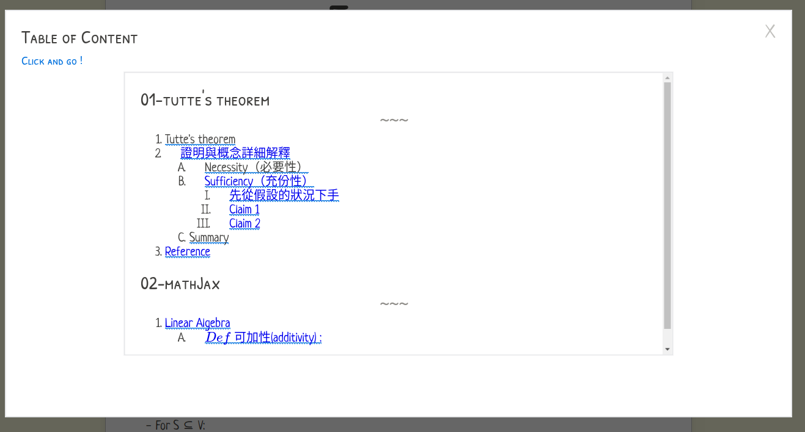
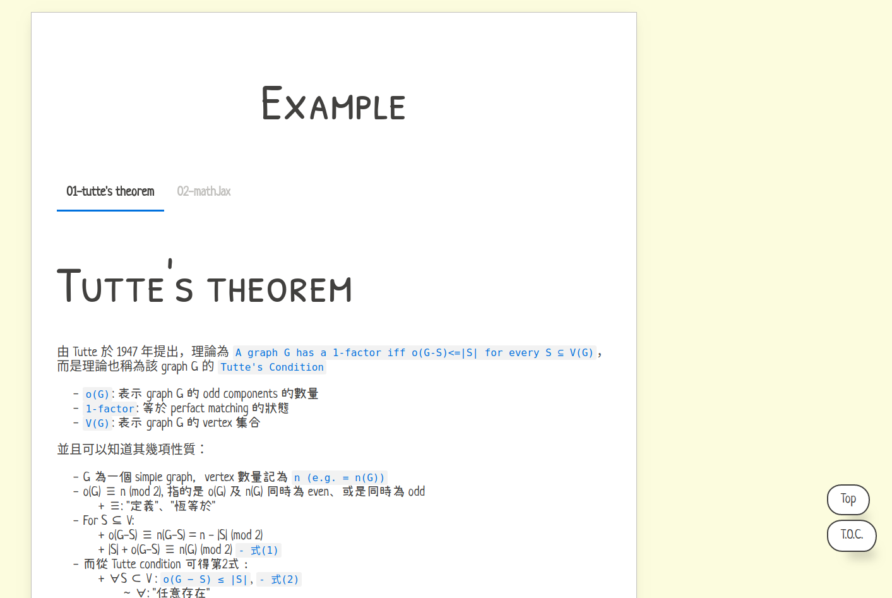

# papoGen
[](https://badge.fury.io/js/papogen)
[](https://www.npmjs.com/package/papogen)

Using paper.css and pug.js to generate.

If you feel `papogen` is good, hope you can give a `star`!

# usage

> [使用說明 - 中文詳細版本](example/)

* Install 
```bash
» [sudo] npm install papogen -g
```

* Help Manual (List out current support)
    * Explain each parameter we support currently!
    * See more in [here](https://github.com/toolbuddy/papoGen/blob/master/example/README.md).

* Generate
```bash
» papogen -s test/ -o docs/ -t papoGen -m doc
```

* Our document [demo page](https://toolbuddy.github.io/papoGen/), is generate by `papoGen`!
    * Using the json files in test/ 
        * In test/, there are several categories of scripts, each one has a directory
        * And there have a `README.md` inside each directory, explain the format of each type.
    * View more:
        * [doc page](https://toolbuddy.github.io/papoGen/)
        * [resume page](https://toolbuddy.github.io/papoGen/resume)

* Generate script template
    * After you using `-h` to list, you can see the last part of all script support.
    * And you can using `papogen -c <script>/<format_1>/<format_2>/... -o <output>` to generate our template file.
        * `<script>` is the blue one. (in `-h` output message)
        * `<format>` is the grey one. (in `-h` output message)
            * version after `0.0.12` support several template specified, use `/` to separate each format.
            * or you can just using `json/all` to get all current support copy to target output directory

* Check our `example/` to see more!

## Markdown (Recommended!)
* Generate from markdown directly.
* *Different* from above format.
* Still support multiple markdown files as input.
* support model:
    * `md_doc`
* Example command:
```
papogen -s test/md -o docs/md -g md -m md_doc -t Graph\ Theory   
```

## json(default)
* Example command:
* See more in [here](https://github.com/toolbuddy/papoGen/blob/master/test/json/README.md)
```bash
# Use directly (from source code)
» node main.js -s test/ -o docs/ -t papoGen
# By install 
» papogen -s test/ -o docs/ -t papoGen -m doc
```
* Using `json` as configuration.
* After specify the `src` directory, paperUI will fetch all .json under `src`, and using each *filename* to be as "tag" in output.
* And then will base on specified format to generate content (see more detail below)
    * Currently support: `text` (see the source dir: `test/` as input, and destination dir: `docs/` as output)

## yaml
* With some format defined in [json](https://github.com/toolbuddy/papoGen/blob/master/test/json/README.md).
* Example command:
```bash
# Use directly (from source code)
» node main.js -s test/ -o docs/ -g yaml -t papoGen
# By install 
» papogen -s test/ -o docs/ -t papoGen -m doc -g yaml
```
* Using `yaml` as configuration.
* After specify the `src` directory, paperUI will fetch all .json under `src`, and using each *filename* to be as "tag" in output.
* And then will base on specified format to generate content (see more detail below)
    * Currently support: `text` (see the source dir: `test/` as input, and destination dir: `docs/` as output)

# Demo

* Generate by papoGen format
   * [JSON - doc](https://toolbuddy.github.io/papoGen/)
   * [JSON - resume](https://toolbuddy.github.io/papoGen/resume/)
   * [YAML - doc](https://toolbuddy.github.io/papoGen/doc-yaml)
   * [YAML - resume](https://toolbuddy.github.io/papoGen/resume-yaml)
* Generate directly from Markdown format
   * [From Markdown - md_doc](https://toolbuddy.github.io/papoGen/md/)
       * Support "MathJax" & "Table of content"!
   * Graph Theory Tutorial:
      * [ch3](https://toolbuddy.github.io/Graph-Theory/matching-factor/index.html)
      * [ch4](https://toolbuddy.github.io/Graph-Theory/connectivity-path/)
   * [simulation project - 802.11 wireless illustration](https://kevinbird61.github.io/simulation-wireless-802.11/)
   * [gRPC practice & learn](https://kevinbird61.github.io/grpc-practice/)

# Changelog
* See [here](https://github.com/toolbuddy/papoGen/wiki).

* Screenshot

| version | Table of content | Main Page |
| ------- | ------- | ------- |
| `v0.2.2` |  |  |  

# Workflow 
* See [here](https://github.com/toolbuddy/papoGen/wiki)

# WIP

If you want to contribute the project, please using `git clone` with `--recursive` to clone the entire project. ( or using `git submodule update` to update your old version. )

* [papoGen.css](https://github.com/toolbuddy/papoGen.css)
    * our new css template is creating now!
    * will introduce the new theme, and template into `papoGen`.


# Author 

[Kevin Cyu](https://github.com/kevinbird61), kevinbird61@gmail.com
