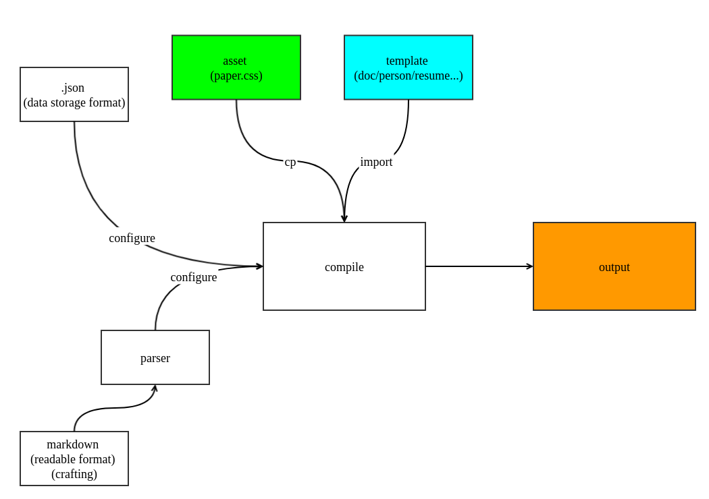

# papoGen
Using paper.css and pug.js to generate.

# workflow



# usage

* Install 
```
» [sudo] npm install papogen -g
```

## json
* Example command:
```bash
# Use directly (from source code)
» node main.js -s test/ -o docs/ -t papoGen
# By install 
» papogen -s test/ -o docs/ -t papoGen
```
* Using `json` as configuration.
* After specify the `src` directory, paperUI will fetch all .json under `src`, and using each *filename* to be as "tag" in output.
* And then will base on specified format to generate content (see more detail below)
    * Currently support: `text` (see the source dir: `test/` as input, and destination dir: `docs/` as output)